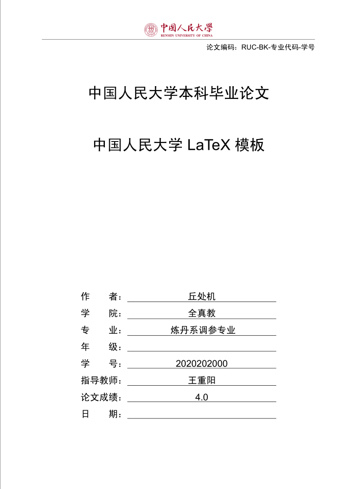

## 中国人民大学 LaTeX 论文模板

不要担心，这个项目一定可以运行

> 符合学校和老师的模板就是好模板，你需要仔细的考虑自己是否需要LaTeX，其实 Word 也是不错的软件。

> 临近毕业，发邮件提问的学弟学妹越来越多了，但一个人的精力有限，有些问题是重复的，有的问题涉及的细节很多。更希望大家开[issue](https://github.com/GH1995/RUC-thesis-template-for-LaTeX/issues)讨论，或者直接发PR给我，这样可以帮助更多的人。


目前支持本科、硕士（学硕+专硕）和博士，排版出来的封面和下面差不多，可以在 [overleaf](https://www.overleaf.com/read/kmjxwrcjstqx
) 上直接预览 



如果已经有`ructhesis.cls`文件的可以直接使用。目前的版本使用了[2015国标](https://github.com/ustctug/gbt-7714-2015)的参考文献样式.

这里我们使用`xelatex`作为排版引擎，这里不建议大家选用其他引擎，比如`pdflatex`之类的，一个原因是这些引擎对于中文的支持不太好，另外`xelatex`更新也比较快。至于网上抱怨的`xelatex`编译性能的问题，实际上我们要知道，一个需要1s编译完成，另一个需要2s，关注这种差别没有意义。

还需要提醒的一点是，我们推荐你使用 Linux，因为无论是 MacTex 还是 Windows 上的 TexLive 安装都容易出错。你会为了排查这种错误而浪费大量的时间。

我们推荐使用`UTF-8`编码，请拒绝 GBK，GB2312 和 BOM 等编码。很不幸的是 Windows 上的默认编码不是 `UTF-8` ，我们推荐你使用 Vim/Emacs/Visual Studio Code。


## 字体文件

如果你使用Ubuntu，极有可能是欠缺一部分关键字体，但是不用担心，我们已经打包好了，可以从[这里](http://pan.baidu.com/s/1eRFJXnW)下载。鉴于百度云的速度实在太慢，建议比较着急的用户直接按字体的名称搜索下载即可。我个人比较喜欢把字体安装在，自己的工作目录下，这样不会和别人共享字体，但是也避免干扰全局环境。记得安装好之后更新一下字体缓存。

- `Times New Roman`
- `Arial`
- `Courier New`
- `宋体`
- `黑体`
- `仿宋`
- `方正小标宋`


## Ubuntu 安装 LaTeX

如果你已经安装好了字体，其实没有安装好也没关系，我们这样就要安装 LaTeX 了。如果你用百度搜索，可能会有些人告诉你那些包需要安装，那些不需要安装，这样可以节省空间。我个人相信人大的学生硬盘还没有这么促狭，我们直接安装了所有 LaTeX 依赖，大概需要 5GB 左右的空间。

```shell
sudo apt install texlive-full
```

## 在Windows下使用（不推荐）

1. 安装[Tex Live](http://www.tug.org/texlive). 把`bin`目录例如`D:\texlive\2016\bin\win32`加入`PATH`环境变量.
2. 安装字体. [下载地址](http://pan.baidu.com/s/1eRFJXnW)，有的字体Windows自带了，有的字体Ubuntu自带了，但都不全，还是一次性安装完所有字体比较方便.
3. 安装[TeXstudio](http://texstudio.sourceforge.net)
4. 配置TeX Studio
    - 启动TeX Studio，选择 `Options-->Configure Texstudio-->Commands`，`XeLaTeX` 设置为 `xelatex -synctex=1 -interaction=nonstopmode %.tex`
    - 选择 `Options-->Configure Texstudio-->Build`
    - `Build & View` 由默认的 `PDF Chain` 改为 `Compile & View`
    - `Default Compiler` 由默认的`pdfLaTeX`修改为`Xelatex`
    - `PDF Viewer`改为`Internal PDF Viewer(windowed)`，这样预览时会弹出一个独立的窗口，这样比较方便
5. 编译. 用`TeX Studio`打开`main.tex`，点击界面上的绿色箭头就可以开始编译了. 在下方的窗口可以看到`TeX Studio`正在使用的编译命令是`xelatex -synctex=1 -interaction=nonstopmode "main".tex`

## 在Ubuntu下用Tex Studio编译
1. `sudo apt install texlive`
2. 安装字体. `mkdir ~/.fonts && cd ~/.fonts`, 把下载好的字体解压复制到这个文件夹，然后`fc-cache -f -v`；
3. 安装`sudo apt install texstudio`
4. 配置`TeX Studio`
    - 启动`TeX Studio`，选择 `Options-->Configure Texstudio-->Commands`，`xelatex` 设置为 `xelatex -synctex=1 -interaction=nonstopmode %.tex`；
    - 选择 `Options-->Configure Texstudio-->Build`
    - `Build & View` 由默认的 `PDF Chain` 改为 `Compile & View`
    - `Default Compiler` 由默认的`pdflatex` 修改为 `xelatex`
    - `PDF Viewer` 改为 `Internal PDF Viewer(windowed)`，这样预览时会弹出一个独立的窗口，这样比较方便.
5. 编译. 用`TeX Studio`打开`main.tex`，点击界面上的绿色箭头就可以开始编译了. 在下方的窗口可以看到`TeX Studio`正在使用的编译命令是`xelatex -synctex=1 -interaction=nonstopmode "main".tex`


